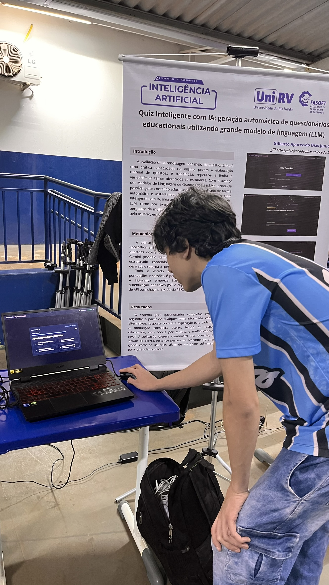
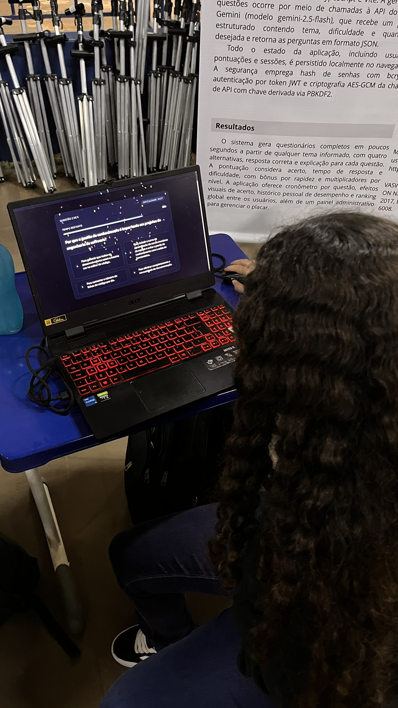
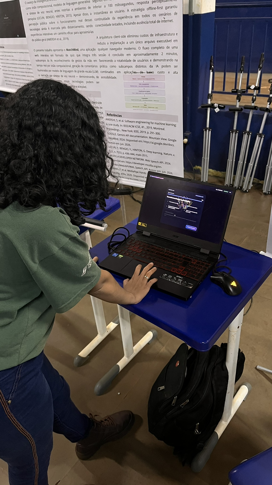
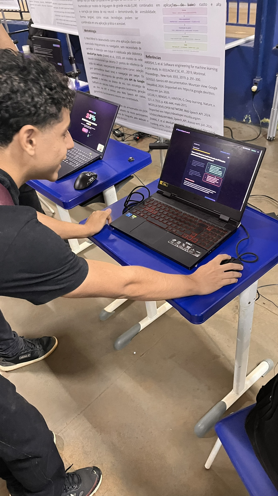
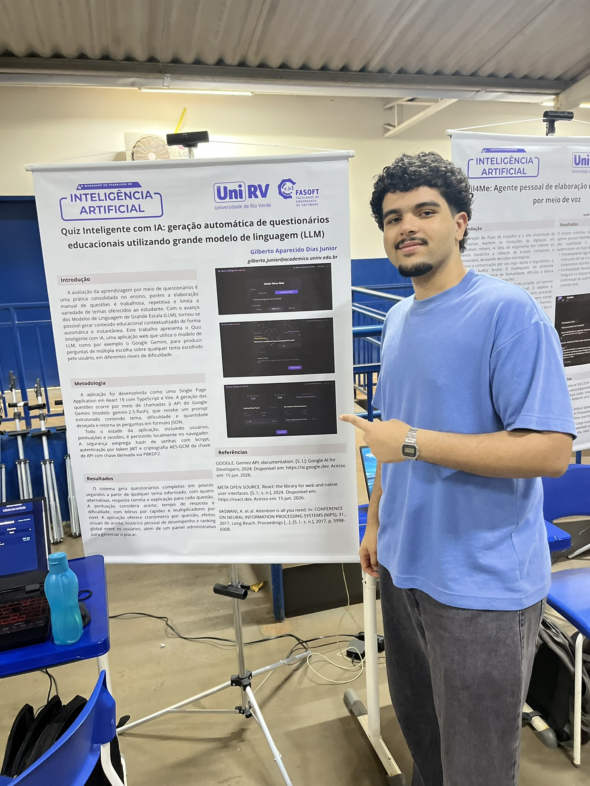
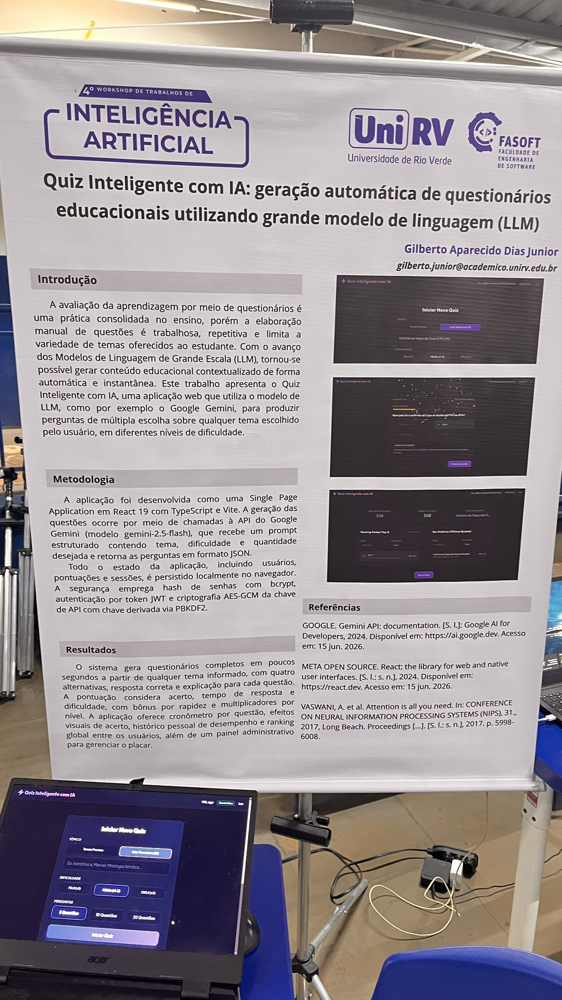
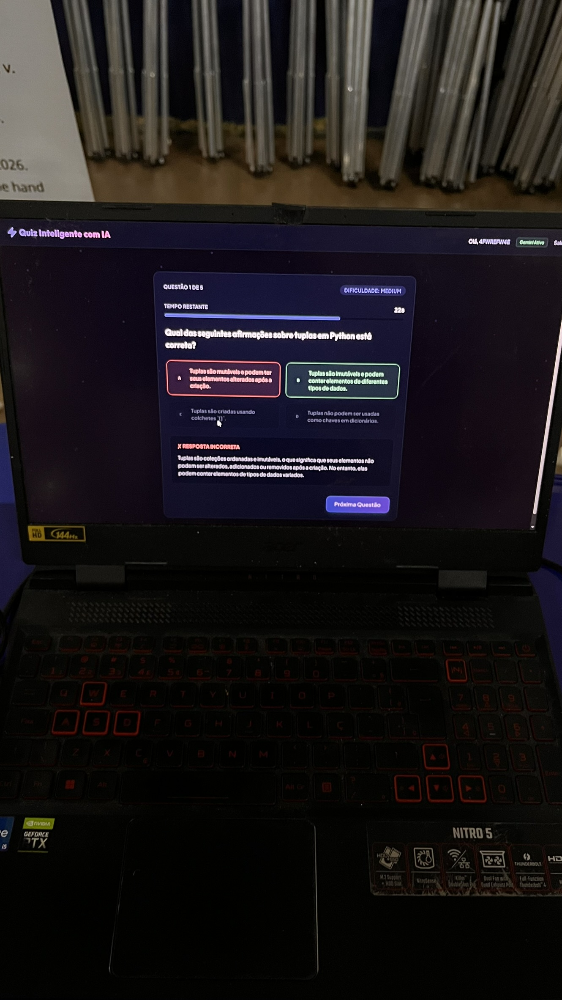
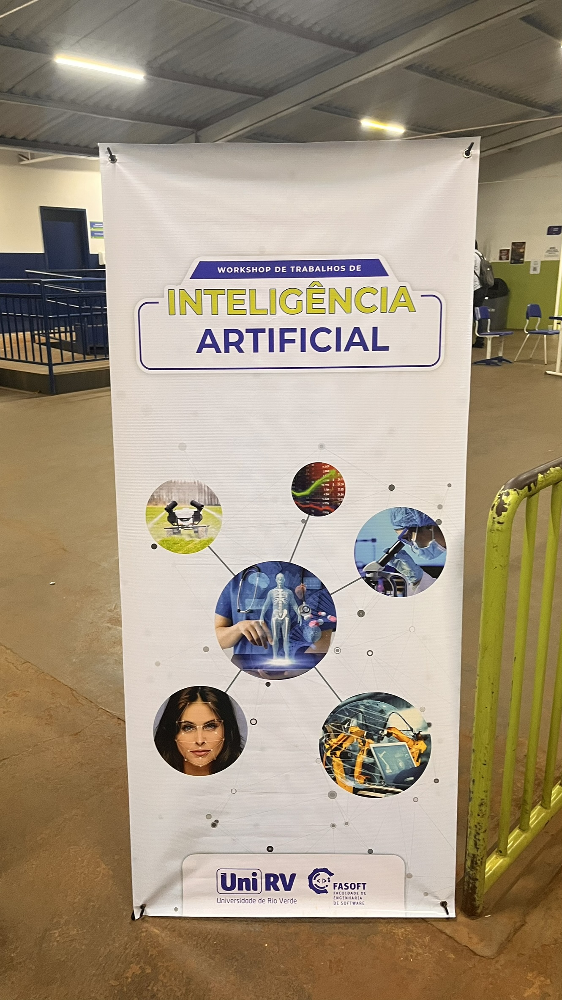
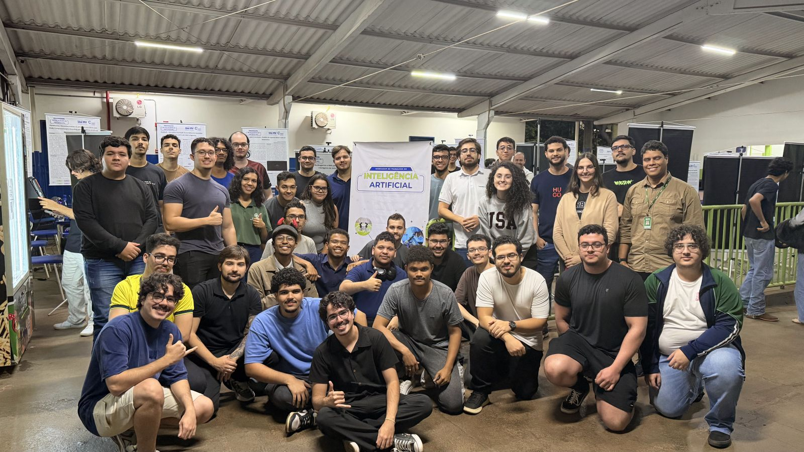
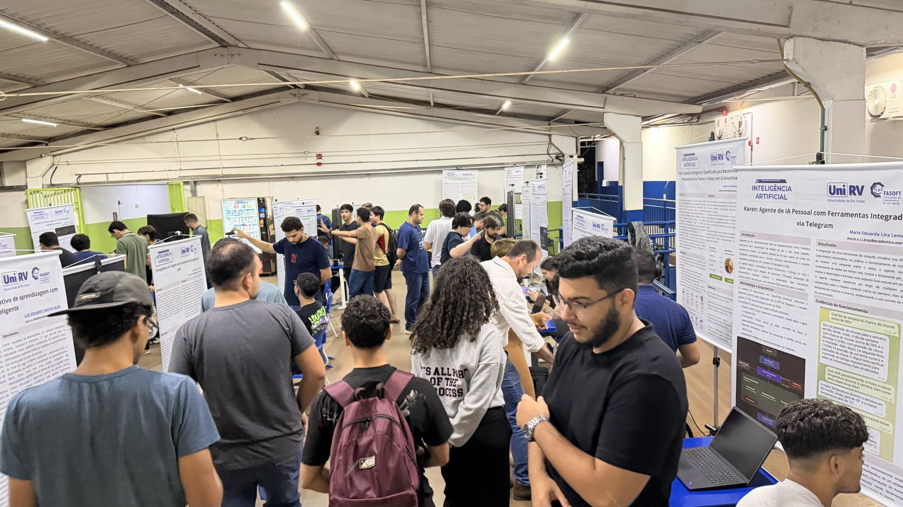

# Quest AI

[](https://vitest.dev/)
[](https://www.typescriptlang.org/)
[](https://react.dev/)
[](https://opensource.org/licenses/MIT)

**Quest AI** é uma aplicação de quizzes inteligentes alimentada por múltiplos provedores de Large Language Models (LLMs), desenvolvida para transformar rotinas de estudo e aprendizado interativo.

O principal **diferencial** e inovação do **Quest AI** reside no seu motor versátil de geração por Inteligência Artificial e na sua arquitetura resiliente de trivia: em vez de depender de um único banco de dados estático, a aplicação utiliza Modelos de Linguagem para sintetizar tópicos, processar materiais de estudo via Geração Aumentada por Recuperação (RAG) e orquestrar mais de 400.000 questões integradas de 9 APIs públicas de trivia com fallbacks automáticos.

A aplicação oferece 5 modos de estudo principais baseados em IA:
1. **Quiz de Tema Livre:** Gera quizzes estruturados sobre qualquer assunto digitado, onde a IA é treinada para identificar e cobrir os conceitos centrais do tema.
2. **Questões Populares de Provas:** Simula questões focadas nos estilos e padrões de exames oficiais, vestibulares, concursos e certificações populares.
3. **Modo RAG (Geração por Documentos):** Extrai contexto de arquivos enviados pelo usuário (PDFs, planilhas Excel `.xlsx` ou JSON) para criar quizzes estritamente baseados no material de estudo.
4. **Integração Multi-Provedor de LLMs:** Permite alternar facilmente entre Google Gemini, OpenAI, Groq, Anthropic Claude, DeepSeek e modelos locais rodando via Ollama.
5. **Saída Estruturada e Explicações:** Garante o cumprimento de esquemas JSON estritos via engenharia de prompt, fornecendo justificativas pedagógicas detalhadas para cada alternativa.

Além disso, o Quest AI conta com salas multiplayer em tempo real (via Supabase Realtime), criptografia local no navegador (AES-GCM 256 bits) para chaves de API e um sistema avançado de pontuação com multiplicadores de combo e bônus de velocidade.

---

### 🏛️ Apresentação Acadêmica

Este projeto foi apresentado no curso de Engenharia de Software durante a [4ª Edição do Workshop de Trabalhos de Inteligência Artificial](https://www.unirv.edu.br/ver_noticias.php?codabr=20273) da [Universidade de Rio Verde](https://www.unirv.edu.br/) (UniRV).

O workshop foi ministrado pelo **Professor Sandro**, a quem agradecemos pela oportunidade de demonstrar como os Modelos de Linguagem podem ser aplicados na prática em atividades rotineiras do dia a dia, como os estudos e a aprendizagem interativa. O **Quest AI** foi apresentado como uma demonstração prática de alta performance sobre como integrar conceitos avançados de IA, engenharia de prompt, pipelines de RAG e padrões de arquitetura de software para construir ferramentas educacionais acessíveis e reais.

#### 📸 Registros do Workshop

Abaixo estão os registros da apresentação do projeto, dos participantes utilizando a aplicação e do evento durante o workshop na UniRV:

##### 🎮 Participantes Interagindo e Jogando o Quest AI

| Participante Jogando 1 | Participante Jogando 2 |
| :-: | :-: |
|  |  |

| Participante Jogando 3 | Participante Jogando 4 |
| :-: | :-: |
|  |  |

##### 💻 Apresentação e Demonstração do Projeto

| Apresentação do Projeto 1 | Apresentação do Projeto 2 | Apresentação do Projeto 3 |
| :-: | :-: | :-: |
|  |  |  |

##### 🏛️ Visão Geral do Workshop (UniRV)

| Registros do Evento 1 | Registros do Evento 2 | Registros do Evento 3 |
| :-: | :-: | :-: |
|  |  |  |

---

## 🎮 Funcionalidades

- **Motor de Estudos com IA**:
  - **Modo Tema Livre:** Digite qualquer assunto e deixe a IA gerar um quiz completo sobre os tópicos principais.
  - **Modo Questões Populares de Prova:** Gere perguntas ajustadas aos padrões e estilos de exames e bancas oficiais.
  - **Modo RAG por Documentos:** Envie arquivos PDF, Excel ou JSON para gerar quizzes baseados estritamente no seu material de estudo.
  - **Multi-Provedor de Modelos:** Conexão flexível com OpenAI, Gemini, Groq, Anthropic, DeepSeek ou instâncias locais do Ollama.
  - **Explicações Pedagógicas:** Todas as questões acompanham explicações passo a passo geradas pela IA.
- **Motor Multi-Fonte de Trivia (400k+ Questões)**: Categorias e áreas consolidadas de 9 APIs públicas (OpenTriviaDB, jService, Bongo, Trivious, TheTriviaAPI, NumbersAPI, DadJokes, PeterAPI, OfficialJokes) com busca paralela via `Promise.allSettled()` e fallback gracioso.
- **Salas Multiplayer em Tempo Real**: Crie ou entre em salas personalizadas com status de membros ao vivo, confirmação de prontidão e estatísticas consolidadas via Supabase Realtime e Prisma PostgreSQL.
- **Segurança Client-Side**: As chaves de API são criptografadas localmente no navegador utilizando a Web Crypto API (AES-GCM de 256 bits com derivação de salt PBKDF2).

## 🛠️ Passo a Passo de Instalação

Siga os passos abaixo para configurar e executar o projeto localmente.

### 1. Pré-requisitos
- **Node.js 18.0 ou superior** instalado.
- Gerenciador de pacotes **npm** ou **yarn**.

### 2. Configuração das Variáveis de Ambiente
Copie o modelo `.env.example` para criar o seu arquivo `.env` local:

```bash
cp .env.example .env
```

Preencha suas credenciais de conexão do Supabase e configurações no arquivo `.env`.

### 3. Instalando Dependências
Instale os pacotes Node.js necessários:

```bash
npm install
```

### 4. Executando a Aplicação
Inicie o servidor de desenvolvimento local do Vite:

```bash
npm run dev
```
Abra o navegador e acesse `http://localhost:5173`.

---

## 🕹️ Comandos Disponíveis (Scripts)

| Comando | Descrição |
| :--- | :--- |
| **`npm run dev`** | Inicia o servidor de desenvolvimento local com HMR |
| **`npm run build`** | Executa a verificação de tipos TypeScript (`tsc -b`) e gera o build de produção |
| **`npm run preview`** | Visualiza a versão de produção localmente |
| **`npm run test`** | Executa a suíte de testes unitários com o Vitest |
| **`npm run lint`** | Executa a análise estática do código com o ESLint |

---

## 📐 Diretrizes de Engenharia e Boas Práticas

O projeto foi arquitetado sob rigorosa disciplina de **Extreme Programming (XP)**, aderindo aos padrões profissionais de engenharia de software e **Clean Code:**

- **TDD & FIRST:** Serviços centrais, rotinas de criptografia, parsers de respostas de IA e lógica de salas são respaldados por testes unitários rápidos, independentes e repetíveis usando Vitest e Happy-DOM.
- **Tipagem Estrita Obrigatória (TypeScript):** 100% das funções, limites de API e props de componentes utilizam interfaces TypeScript explícitas (`src/types/`).
- **Modularidade & Princípio da Responsabilidade Única (SRP):**
  - **Funções Curtas:** As funções de lógica de negócio mantêm escopo focado em uma única responsabilidade.
  - **Padrão Adapter/Strategy:** Provedores de LLM (`src/services/llm/`) e fontes de trivia (`src/services/providers/`) utilizam abstrações limpas para fácil extensibilidade.
- **Redução de Aninhamento (Early Returns):** O fluxo de execução prioriza guard clauses e retornos antecipados para manter a complexidade ciclomática baixa.
- **Segurança Client-Side:** Primitivas criptográficas (Web Crypto API AES-GCM) isolam as API Keys dos usuários sem expô-las em servidores backend.

### Estrutura de Módulos:
- `src/components/`: Componentes de interface React segregados por funcionalidade (`Quiz/`, `Room/`, `Auth/`, `ApiKey/`, `Common/`, `Marketing/`).
- `src/services/`: Serviços com as regras de negócio centrais (`llmService.ts`, `multiSourceTriviaService.ts`, `authService.ts`, `roomService.ts`, `scoreManager.ts`).
- `src/hooks/`: Hooks React customizados para gerenciamento de sessão, orquestração de trivia, upload de arquivos e conexões realtime.
- `src/utils/`: Utilitários de segurança, criptografia, parsing de arquivos e validações.
- `api/`: Funções Serverless da Vercel para endpoints backend, CORS, autenticação e cliente Prisma ORM.
- `prisma/`: Schema do Prisma definindo os modelos `Profile`, `Quiz`, `Room`, `RoomMember` e `QuizAttempt`.

---

## 🧪 Suíte de Testes e Integração

O repositório possui uma suíte completa de testes unitários desenvolvida com **Vitest**.

### Executando os Testes Unitários:
```bash
npm run test
```

Os testes cobrem e validam:
- Autenticação e verificação de tokens JWT (`authService.test.ts`, `authHeader.test.ts`).
- Rotinas de criptografia e descriptografia (`encryption.test.ts`).
- Construtores de prompt de IA e validação de esquemas (`llmService.test.ts`).
- Gerenciamento de salas e papéis de membros (`roomService.test.ts`).
- Cálculo de pontuações e gamificação (`scoreManager.test.ts`).
- Consolidação de trivia multi-fonte (`triviaService.test.ts`).
